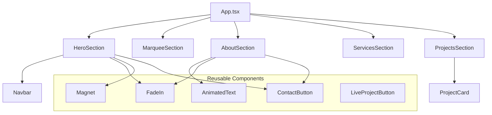

# Design Document: 3D Creator Portfolio Landing Page

## Overview

A single-page React portfolio for "Jack" (a 3D creator) built with Vite, TypeScript, Tailwind CSS, Framer Motion, and Lucide React. The page delivers a cinematic dark-themed experience with scroll-driven animations, a magnetic hover portrait, marquee image galleries, character-by-character text reveal, and sticky-stacking project cards.

The architecture follows a flat section-based layout where `App.tsx` renders five top-level section components in sequence. Reusable animation primitives (`FadeIn`, `Magnet`, `AnimatedText`) encapsulate Framer Motion logic and are composed into section components. Scroll-driven effects rely on Framer Motion's `useScroll`/`useTransform` hooks and raw `window.scrollY` listeners with `requestAnimationFrame` for performance.

## Architecture



### Project Structure

```
src/
├── App.tsx                    # Root component, section orchestration
├── main.tsx                   # Entry point, React DOM render
├── index.css                  # Tailwind directives, global styles, .hero-heading
├── components/
│   ├── HeroSection.tsx
│   ├── Navbar.tsx
│   ├── MarqueeSection.tsx
│   ├── AboutSection.tsx
│   ├── ServicesSection.tsx
│   ├── ProjectsSection.tsx
│   ├── ProjectCard.tsx
│   ├── ContactButton.tsx
│   ├── LiveProjectButton.tsx
│   ├── FadeIn.tsx
│   ├── Magnet.tsx
│   └── AnimatedText.tsx
├── data/
│   ├── projects.ts            # Project card data (title, images, link)
│   └── services.ts            # Services list data
├── assets/
│   ├── portrait.webp
│   ├── marquee/               # 21 GIF files
│   └── about/                 # 4 decorative corner images
└── vite-env.d.ts
```

### Data Flow

Data flows unidirectionally top-down:
1. Static data arrays (`projects.ts`, `services.ts`) imported directly by section components
2. Scroll position is read via Framer Motion hooks (`useScroll`) or `window` event listeners — no global scroll state
3. Mouse position for the Magnet effect is local state within the `Magnet` component
4. No external state management needed — all state is component-local

## Components and Interfaces

### App Component

```typescript
// App.tsx - Root layout
const App: React.FC = () => (
  <div className="bg-[#0C0C0C] text-white font-kanit" style={{ overflowX: 'clip' }}>
    <HeroSection />
    <MarqueeSection />
    <AboutSection />
    <ServicesSection />
    <ProjectsSection />
  </div>
);
```

### FadeIn Component

```typescript
interface FadeInProps {
  children: React.ReactNode;
  delay?: number;       // seconds, default 0
  y?: number;           // pixels, default 20
  className?: string;
}
```

Uses Framer Motion `motion.div` with `whileInView` trigger:
- `initial`: `{ opacity: 0, y }`
- `whileInView`: `{ opacity: 1, y: 0 }`
- `transition`: `{ duration: 0.6, delay, ease: 'easeOut' }`
- `viewport`: `{ once: true }`

### Magnet Component

```typescript
interface MagnetProps {
  children: React.ReactNode;
  padding?: number;      // px, hover detection area beyond element bounds
  strength?: number;     // multiplier for displacement (default 1)
  activeTransition?: string;    // CSS transition when cursor inside
  inactiveTransition?: string;  // CSS transition when cursor leaves
}
```

### AnimatedText Component

```typescript
interface AnimatedTextProps {
  text: string;
  className?: string;
}
```

Uses `useScroll` with the container ref as `target` and `useTransform` to map scroll progress `[0, 1]` to per-character opacity values.

### ContactButton Component

```typescript
interface ContactButtonProps {
  className?: string;
}
```

Renders a pill-shaped `<button>` with a linear-gradient background and white text.

### LiveProjectButton Component

```typescript
interface LiveProjectButtonProps {
  href: string;
  className?: string;
}
```

Renders a pill-shaped `<a>` with a transparent background, white border, and an external-link icon from Lucide React.

### ProjectCard Component

```typescript
interface ProjectCardProps {
  title: string;
  images: string[];
  link: string;
  index: number;        // position in list for sticky offset calculation
  totalCards: number;   // total number of cards for scale calculation
  range: [number, number];   // scroll progress range for this card
  targetScale: number;       // scale value when fully scrolled past
}
```


### MarqueeSection Component

```typescript
// Internal state
interface MarqueeState {
  offset: number;  // Calculated from scroll position relative to section
}
```

Uses a scroll event listener with `requestAnimationFrame` to compute:
```
offset = (window.scrollY - sectionTop + window.innerHeight) * 0.3
```

Row 1 transforms: `translateX(${offset - 200}px)`  
Row 2 transforms: `translateX(${-(offset - 200)}px)`

### Navbar Component

```typescript
interface NavbarProps {
  links: Array<{ label: string; href: string }>;
}
```

Default links: About, Price, Projects, Contact.

## Data Models

### Project Data

```typescript
interface Project {
  title: string;
  images: string[];    // Array of image paths for the project grid
  link: string;        // External URL for live project
}

const projects: Project[] = [
  { title: "Nextlevel Studio", images: [...], link: "..." },
  { title: "Aura Brand Identity", images: [...], link: "..." },
  { title: "Solaris Digital", images: [...], link: "..." },
];
```

### Service Data

```typescript
interface Service {
  number: string;      // Display number, e.g. "01"
  title: string;
}

const services: Service[] = [
  { number: "01", title: "3D Modeling" },
  { number: "02", title: "Rendering" },
  { number: "03", title: "Motion Design" },
  { number: "04", title: "Branding" },
  { number: "05", title: "Web Design" },
];
```

### Marquee Image Data

```typescript
// 21 GIF images split into two rows
const row1Images: string[] = [/* first 11 GIF paths */];
const row2Images: string[] = [/* remaining 10 GIF paths */];
```

### Key Algorithms

#### Magnet Component Mouse Tracking

```typescript
// Algorithm: Magnetic displacement calculation
function handleMouseMove(e: MouseEvent) {
  const rect = elementRef.current.getBoundingClientRect();
  const centerX = rect.left + rect.width / 2;
  const centerY = rect.top + rect.height / 2;

  // Distance from cursor to element center
  const deltaX = e.clientX - centerX;
  const deltaY = e.clientY - centerY;

  // Check if cursor is within padding area
  const expandedBounds = {
    left: rect.left - padding,
    right: rect.right + padding,
    top: rect.top - padding,
    bottom: rect.bottom + padding,
  };

  if (isWithinBounds(e, expandedBounds)) {
    // Apply displacement scaled by strength
    setTranslate({
      x: deltaX / strength,
      y: deltaY / strength,
    });
    setIsActive(true);
  }
}

function handleMouseLeave() {
  setTranslate({ x: 0, y: 0 });
  setIsActive(false);
}
```

The element applies:
```css
transform: translate(${x}px, ${y}px);
transition: ${isActive ? activeTransition : inactiveTransition};
```

#### AnimatedText Scroll-Based Character Reveal

```typescript
// Algorithm: Per-character opacity from scroll progress
function AnimatedText({ text }: AnimatedTextProps) {
  const containerRef = useRef<HTMLParagraphElement>(null);
  const { scrollYProgress } = useScroll({
    target: containerRef,
    offset: ["start 0.9", "start 0.25"],  // trigger range
  });

  const characters = text.split("");

  return (
    <p ref={containerRef}>
      {characters.map((char, i) => {
        // Each character maps a sub-range of scroll progress to opacity
        const start = i / characters.length;
        const end = start + 1 / characters.length;
        const opacity = useTransform(scrollYProgress, [start, end], [0.2, 1]);

        return <motion.span style={{ opacity }}>{char}</motion.span>;
      })}
    </p>
  );
}
```

#### Project Card Sticky-Stack with Scale

```typescript
// Algorithm: Sticky stacking with progressive scale-down
function ProjectCard({ index, totalCards, range, targetScale }: ProjectCardProps) {
  const containerRef = useRef<HTMLDivElement>(null);
  const { scrollYProgress } = useScroll({
    target: containerRef,
    offset: ["start end", "end end"],
  });

  // Scale decreases as next card scrolls over this one
  const scale = useTransform(scrollYProgress, range, [1, targetScale]);

  return (
    <div ref={containerRef} className="h-screen sticky" style={{ top: `${40 + index * 25}px` }}>
      <motion.div style={{ scale }}>
        {/* Card content */}
      </motion.div>
    </div>
  );
}

// In ProjectsSection, compute per-card ranges:
// targetScale = 1 - (totalCards - index) * 0.05
// range = [index * (1 / totalCards), 1]
```

#### Marquee Scroll Parallax

```typescript
// Algorithm: Bidirectional scroll-driven marquee
function MarqueeSection() {
  const sectionRef = useRef<HTMLElement>(null);
  const [offset, setOffset] = useState(0);

  useEffect(() => {
    let rafId: number;
    const onScroll = () => {
      rafId = requestAnimationFrame(() => {
        const sectionTop = sectionRef.current?.offsetTop ?? 0;
        const newOffset = (window.scrollY - sectionTop + window.innerHeight) * 0.3;
        setOffset(newOffset);
      });
    };
    window.addEventListener("scroll", onScroll, { passive: true });
    return () => {
      window.removeEventListener("scroll", onScroll);
      cancelAnimationFrame(rafId);
    };
  }, []);

  // Row 1: translateX(offset - 200) — moves right
  // Row 2: translateX(-(offset - 200)) — moves left
}
```

#### FadeIn Animation Timing

```typescript
// Sequential delays for HeroSection elements:
// Navbar:        delay=0,    y=-20
// Heading:       delay=0.15, y=40
// Left tagline:  delay=0.35, y=20
// ContactButton: delay=0.5,  y=20
// Portrait:      delay=0.6,  y=30
```

### Responsive Design Approach

- **Breakpoints**: Tailwind defaults — `sm: 640px`, `md: 768px`, `lg: 1024px`
- **Fluid typography**: `clamp()` for paragraph text, `vw` units for hero heading
- **Conditional layout**: Portrait positioning shifts from centered (mobile) to bottom-aligned (sm+)
- **Image sizing**: Percentage-based or responsive width classes (`w-[280px] sm:w-[360px] md:w-[440px] lg:w-[520px]`)
- **Spacing scales**: Tailwind responsive padding/margin utilities (`px-6 md:px-10`, `pt-24 sm:pt-32 md:pt-40`)


## Correctness Properties

*A property is a characteristic or behavior that should hold true across all valid executions of a system — essentially, a formal statement about what the system should do. Properties serve as the bridge between human-readable specifications and machine-verifiable correctness guarantees.*

### Property 1: Magnet displacement proportional to cursor position

*For any* mouse position within the Magnet component's padding area, the element's translation should equal `(cursorX - centerX) / strength` on the X axis and `(cursorY - centerY) / strength` on the Y axis, where center is the element's bounding box center.

**Validates: Requirements 5.5**

### Property 2: Magnet returns to origin on cursor leave

*For any* displacement state of the Magnet component (any prior translate x,y values), when the cursor exits the padding area, the element's translation should return to (0, 0).

**Validates: Requirements 5.6**

### Property 3: Marquee bidirectional scroll offset

*For any* scroll position (scrollY ≥ 0), section top offset, and window height, the marquee offset should equal `(scrollY - sectionTop + windowHeight) * 0.3`, Row 1's transform should be `translateX(offset - 200)`, and Row 2's transform should be `translateX(-(offset - 200))`.

**Validates: Requirements 7.3, 7.4, 7.5**

### Property 4: AnimatedText per-character opacity from scroll progress

*For any* text string of length N and any scroll progress value p in [0, 1], the character at index i should have opacity equal to the linear interpolation of [0.2, 1] over the sub-range [i/N, (i+1)/N] of p. Characters before the current scroll window should be at 0.2 opacity, and characters past it should be at 1.0 opacity.

**Validates: Requirements 8.4**

### Property 5: Service sequential numbering

*For any* list of services with length N, the service at index i (0-based) should display the number formatted as a zero-padded two-digit string equal to `String(i + 1).padStart(2, '0')`.

**Validates: Requirements 9.3**

### Property 6: ProjectCard progressive scale calculation

*For any* list of N project cards, the card at index i should have a target scale of `1 - (N - i) * 0.05`, and its scale should interpolate from 1 to that target scale as the scroll progress moves through its assigned range `[i * (1/N), 1]`.

**Validates: Requirements 10.4**

### Property 7: FadeIn animation parameter mapping

*For any* valid delay value (≥ 0) and any y offset value, the FadeIn component should produce initial state `{ opacity: 0, y: y }` and whileInView state `{ opacity: 1, y: 0 }` with transition delay equal to the provided delay value.

**Validates: Requirements 12.1, 12.3**

## Error Handling

### Asset Loading

- Images use `loading="lazy"` to defer off-screen loading
- Missing GIF/image assets: the layout should not break — images use `object-cover` and fixed dimensions so missing assets leave a blank tile rather than collapsing the layout
- Portrait image: if it fails to load, the Magnet component still renders (empty area), other hero elements remain functional

### Scroll Event Performance

- Marquee scroll handler wrapped in `requestAnimationFrame` to prevent layout thrashing
- `passive: true` on scroll listeners to avoid blocking main thread
- `willChange: 'transform'` hints to the browser for GPU compositing on animated rows

### Browser Compatibility

- `-webkit-background-clip: text` and `-webkit-text-fill-color: transparent` used alongside standard properties for gradient text
- Framer Motion handles cross-browser animation differences internally
- `overflow-x: clip` (modern) used instead of `hidden` to allow sticky positioning to work correctly within sections

### Edge Cases

- Zero-length text passed to AnimatedText: renders nothing, no division-by-zero (character loop is empty)
- Scroll position before MarqueeSection enters viewport: offset will be negative, rows shifted far off-screen (invisible, no visual issue)
- Very fast scrolling: `requestAnimationFrame` naturally throttles to display refresh rate

## Testing Strategy

### Unit Tests

Focus on specific examples, edge cases, and integration points:

- **Component rendering**: Each section renders correct text content, correct number of child elements
- **Navbar**: Renders exactly 4 links with correct labels and correct href values
- **ServicesSection**: Renders 5 items with correct titles
- **ProjectsSection**: Renders 3 cards with correct project titles
- **ContactButton**: Renders with gradient background style and correct text
- **Section order**: App renders sections in correct DOM order
- **Edge cases**: AnimatedText with empty string, Magnet with zero padding, FadeIn with negative y offset

### Property-Based Tests

Property-based testing library: **fast-check** (TypeScript/JavaScript PBT library)

Configuration: Minimum 100 iterations per property test.

Each property test references its design document property with the tag format:

```
// Feature: 3d-creator-portfolio, Property {N}: {property_text}
```

**Property tests to implement:**

1. **Magnet displacement** — Generate random cursor positions within bounds, verify displacement formula
2. **Magnet return to origin** — Generate random prior states, simulate leave, verify (0,0) result
3. **Marquee offset calculation** — Generate random scrollY, sectionTop, windowHeight values, verify formula for both rows
4. **AnimatedText opacity mapping** — Generate random strings and scroll progress values, verify per-character opacity
5. **Service numbering** — Generate random-length service arrays, verify zero-padded numbering
6. **ProjectCard scale** — Generate random card counts and indices, verify target scale formula
7. **FadeIn parameter mapping** — Generate random delay and y values, verify animation config output

### Test Organization

```
src/
├── __tests__/
│   ├── unit/
│   │   ├── Navbar.test.tsx
│   │   ├── ServicesSection.test.tsx
│   │   ├── ProjectsSection.test.tsx
│   │   ├── ContactButton.test.tsx
│   │   └── SectionOrder.test.tsx
│   └── properties/
│       ├── magnet.property.test.ts
│       ├── marquee.property.test.ts
│       ├── animatedText.property.test.ts
│       ├── services.property.test.ts
│       ├── projectCard.property.test.ts
│       └── fadeIn.property.test.ts
```

### Testing Tools

- **Vitest** — test runner (aligns with Vite)
- **@testing-library/react** — component rendering and DOM assertions
- **fast-check** — property-based test generation (minimum 100 runs per property)
- **jsdom** — browser environment simulation for unit tests
